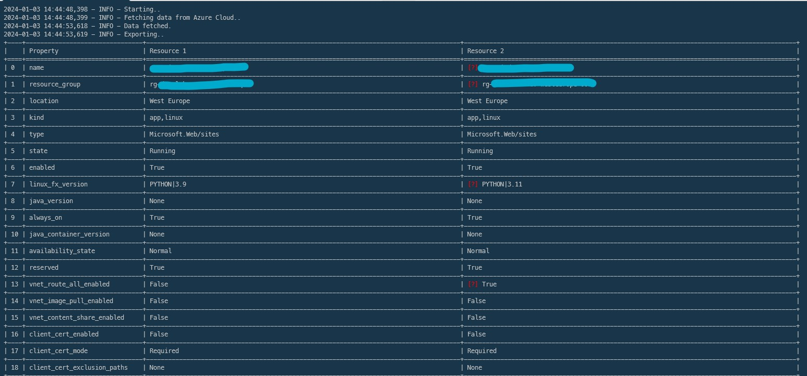

# AzDiff v0.1


## What is AzDiff?

- Have you been trying to manually compare two Azure resources, jumping between Azure portal tabs dozens of times?
- Have you encountred a confusing situation when a solution is working fine in environment A but failing in environment B ?
<br />
Well, say no more, I have been there, so I created this tool that will help you compare the configuration between two Azure resources (Function apps, app services, Virtual Machines..) and will return the properties of each resources and will highlight the differences.

## Usage example

Install the package

```bash
pip install azdiff
```

Login using `az login` or [sign in using a service principal](https://docs.microsoft.com/en-us/cli/azure/create-an-azure-service-principal-azure-cli?view=azure-cli-latest#sign-in-using-a-service-principalt).


```python
export SUBSCRIPTION_ID={SUBSCRIPTION_ID}
azdiff appservice  --resource_name1={resource_name1} --rg_name1={rg_name1} --resource_name2={resource_name2} --rg_name2={rg_name2}
```
Result:
<br />
notice the differences are marked in red with [?]

<br />




Available commands (--help):
```python
Usage: azdiff [OPTIONS] COMMAND [ARGS]...

Options:
  --debug / --no-debug  Enable debug mode
  --help                Show this message and exit.

Commands:
  appservice
  functionapp
  serviceplan
  vm
```


## Build

### Local Development

- install [python3](https://www.python.org/downloads/) (tested with Python 3.8.10)
- I recommend to use [Python3 virtual environments](https://packaging.python.org/guides/installing-using-pip-and-virtual-environments/#installing-virtualenv).
- install `REQUIREMENTS.txt` and run:

```bash
 pip install -r requirements.txt
 python3 main.py
```


### Package as wheel

```bash
# install wheel
pip install wheel
# build python wheel package
python3 setup.py bdist_wheel --version {0.b123}
# install the wheel created from the previous step
pip install {package_path}.whl
# test run
azdiff
```

# Contribute

Contributions are welcome:
1. Please pick any of the features in the backlog [here](https://github.com/RachidAZ/AzDiff/issues/2), or contact me to align if you have other ideas,
2. Please make your PR against the dev branch,
3. Please make sure that your PR includes functional tests with screenshots (as I still don't have a proper unit tests, or feel free to implement them :) )


Thank you!
